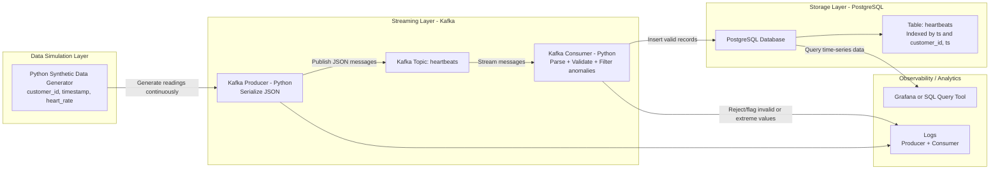

# Real-Time Customer Heartbeat Monitoring Pipeline

This project implements a standard data-engineering style streaming pipeline:

- Synthetic heartbeat generation in Python
- Kafka topic ingestion (`heartbeats`)
- Stream processing with validation and anomaly logging
- PostgreSQL storage optimized for time-series queries

## Architecture



## Project Structure

```text
.
|-- docker-compose.yml
|-- .env.example
|-- grafana/
|   |-- dashboards/
|   |   `-- heartbeat-overview.json
|   `-- provisioning/
|       |-- dashboards/
|       |   `-- dashboards.yml
|       `-- datasources/
|           `-- postgres.yml
|-- sql/
|   `-- init.sql
|-- src/
|   |-- producer.py
|   |-- consumer.py
|   |-- test_data_producer.py
|   `-- heartbeat_pipeline/
|       |-- config.py
|       |-- db.py
|       |-- generator.py
|       |-- logging_utils.py
|       `-- models.py
|-- requirements.txt
`-- README.md
```

## Prerequisites

- Python 3.10+
- Docker Desktop

## Setup

1. Copy environment config:

```bash
copy .env.example .env
```

2. Install dependencies:

```bash
python -m venv .venv
.venv\Scripts\activate
pip install -r requirements.txt
```

3. Start infrastructure and apps:

```bash
docker compose up -d --build
```

4. Validate containers:

```bash
docker compose ps
```

## Run Pipeline

Producer and consumer are now containerized and start automatically with Compose.

Check app logs:

```bash
docker logs -f heartbeat-consumer
docker logs -f heartbeat-producer
```

Optional local run (instead of containers):

```bash
python src\consumer.py
python src\producer.py
```

## Test Scenarios

Publish deterministic test payloads:

```bash
python src\test_data_producer.py
```

This sends:

- Valid normal pulse
- Valid low/high anomalies (logged as warnings, still stored)
- Invalid out-of-range value (rejected)
- Malformed payload (rejected)

## Query Database

```bash
docker exec -it postgres psql -U heartbeat_user -d heartbeat_db -c "SELECT customer_id, ts, heart_rate FROM public.heartbeats ORDER BY ts DESC LIMIT 20;"
```

## Kafka Topic Check

Use Confluent Kafka UI at:

- `http://localhost:8080`

## Grafana Dashboard

Grafana is now part of the stack with automatic provisioning.

- URL: `http://localhost:3000`
- Username: `admin`
- Password: `admin`
- Datasource: `Postgres-Heartbeats` (auto-created)
- Dashboard folder: `Heartbeat Monitoring` (auto-created)
- Dashboard name: `Heartbeat Monitoring Overview`

If you changed credentials in `docker-compose.yml`, use those values for login.

## Logging Standards Implemented

- Centralized log format and level configuration
- Structured, contextual logs for publish/store/reject events
- Warning logs for anomalies and malformed payloads
- Exception logs for Kafka failures

## Stop Stack

```bash
docker compose down
```

To also remove volume data:

```bash
docker compose down -v
```
